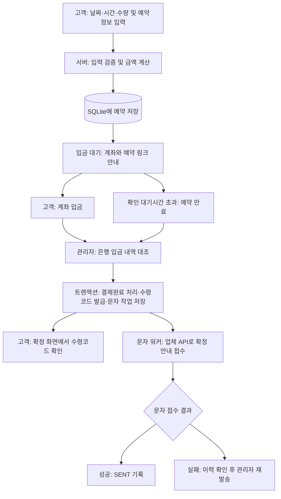
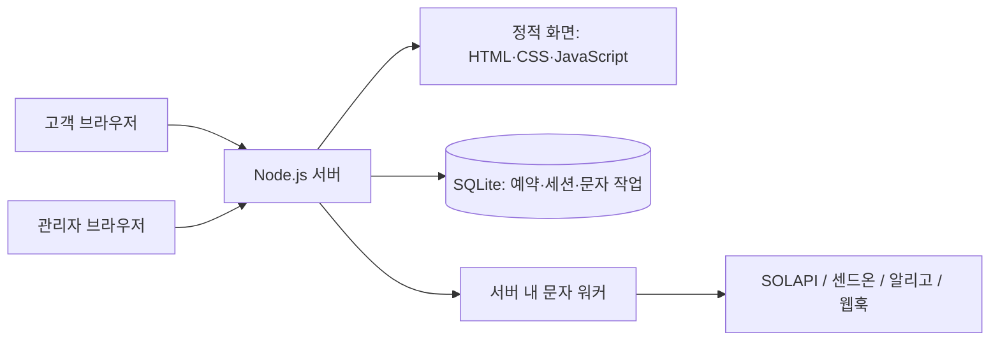

# 반쎄오갱기데스까 사전예약

축제 부스의 반쎄오 사전예약을 위한 모바일 우선 웹 서비스입니다. 고객은 수령 날짜·시간과 수량을 선택해 예약하고, 관리자는 입금을 확인한 뒤 수령코드와 확정 안내 문자를 발급합니다.

**예약 접수 → 계좌 입금 → 관리자 입금 확인 → 수령코드 발급 → 확정 문자 발송**을 하나의 서비스에서 관리합니다.

## 주요 기능

| 고객 | 관리자 |
|---|---|
| 상품·축제 안내 확인 | 로그인 및 예약 목록 조회 |
| 수령 날짜·시간·수량 선택 | 예약자·입금자·전화번호·예약번호 검색 |
| 예약 금액 확인 및 예약 생성 | 상태별 필터와 날짜별 상품 수량 집계 |
| 입금 계좌 복사 및 예약 링크 저장 | 입금 확인 및 6자리 수령코드 발급 |
| 입금 대기·만료·확정 상태 조회 | 만료 예약의 입금 확인 및 복구 |
| 확정 후 수령코드 확인 | 문자 이력 조회·재발송·예약 영구 삭제 |

## 예약 처리 파이프라인



입금 확인은 관리자가 실제 은행 내역을 대조해 처리합니다. 예약 상태와 문자 상태를 따로 관리하므로 **문자 발송에 실패해도 결제완료 상태와 수령코드는 유지**됩니다. 문자 상태의 `SENT`는 업체 접수를 뜻하며, 실제 수신 여부는 업체 발송 내역에서 확인합니다.

| 예약 상태 | 의미 |
|---|---|
| `WAITING_PAYMENT` | 예약 생성 후 입금 확인 대기 |
| `EXPIRED` | 확인 대기시간 초과. 날짜별 예약 수량 집계에서 제외 |
| `PAID` | 관리자 입금 확인 완료. 수령코드 발급 |

실제 입금이 확인된 만료 예약도 관리자가 결제완료로 처리할 수 있습니다.

## 서비스 구조



| 영역 | 구성 |
|---|---|
| 프런트엔드 | HTML, CSS, Vanilla JavaScript · 모바일 기준 390px 레이아웃 |
| 백엔드 | Node.js 내장 HTTP 서버 및 REST API |
| 데이터베이스 | Node.js 내장 SQLite · WAL 모드 |
| 문자 처리 | SQLite 작업 이력 + 서버 내 주기적 워커 |
| 배포 | Docker · Railway 단일 서비스 + 영구 볼륨 |

외부 npm 패키지 설치 없이 실행합니다. 예약·입금 확정·문자 작업 생성에는 SQLite `BEGIN IMMEDIATE` 트랜잭션을 사용하고, 수령코드 중복은 난수 생성과 UNIQUE 제약으로 방지합니다.

## 로컬 실행

**Node.js 22.15 이상**이 필요합니다.

```powershell
Copy-Item .env.example .env
# .env에 관리자 비밀번호, 입금 계좌, CONTACT_PHONE을 설정합니다.
npm start
```

| 화면 | 주소 |
|---|---|
| 고객 예약 | http://127.0.0.1:3000/reserve |
| 축제 안내 | http://127.0.0.1:3000/festival |
| 관리자 로그인 | http://127.0.0.1:3000/admin/login |

- `.env.example`을 복사한 경우: `admin` / `change-this-before-deploying`
- `.env` 없이 실행한 로컬 기본 계정: `admin` / `banhxeo-local-2026`
- 기본 DB 경로는 `data/reservations.sqlite`이며, 서버를 재시작해도 데이터가 유지됩니다.
- 예시 예약은 자동 생성하지 않습니다. 고객 화면에서 예약한 뒤 관리자 화면에서 확인하세요.
- 기본 문자 모드는 `mock`으로 실제 문자를 보내지 않습니다.

### 주요 환경 변수

전체 설정 항목은 [`.env.example`](.env.example)을 참고하세요.

| 변수 | 설명 | 기본값 또는 예시 |
|---|---|---|
| `PORT` / `HOST` | 서버 포트 / 접속 주소 | `3000` / `127.0.0.1` |
| `ADMIN_USERNAME` / `ADMIN_PASSWORD` | 관리자 계정 | 운영 전 변경 |
| `BANK_NAME` / `BANK_ACCOUNT` / `BANK_ACCOUNT_HOLDER` | 입금 은행·계좌·예금주 | 실제 운영 정보로 설정 |
| `CONTACT_PHONE` | 고객 문의 전화번호(숫자만) | 운영 환경에서 필수 설정 |
| `RESERVATION_UNIT_PRICE` | 상품 단가 | `5500`원 |
| `MAX_ORDER_QUANTITY` | 예약 1건의 최대 수량 | `5`개 |
| `PAYMENT_TIMEOUT_MINUTES` | 입금 확인 대기시간 | `1440`분(24시간) |
| `PREORDER_CLOSE_AT` | 신규 예약 마감 시각 | `2026-10-06T00:00:00+09:00` |
| `SMS_MODE` | 문자 발송 방식 | `mock` |
| `DATA_DIR` | SQLite 저장 디렉터리 | 로컬 `data`, 배포 `/data` |
| `NODE_ENV` | 실행 환경 | 로컬 `development`, 운영 `production` |

## 문자 연동

| `SMS_MODE` | 용도 | 설정 |
|---|---|---|
| `mock` | 실제 발송 없이 성공 시뮬레이션 | 로컬 기본값 |
| `mock-fail` | 3회 실패 후 `FAILED` 처리 | 실패·재발송 화면 확인 |
| `solapi` | SOLAPI 발송 | `SOLAPI_API_KEY`, `SOLAPI_API_SECRET`, `SOLAPI_SENDER` |
| `sendon` | 센드온 발송 | `SENDON_USER_ID`, `SENDON_API_KEY`, `SENDON_SENDER` |
| `aligo` | 알리고 발송 | `ALIGO_USER_ID`, `ALIGO_API_KEY`, `ALIGO_SENDER` |
| `webhook` | 자체 문자 어댑터 연결 | `SMS_WEBHOOK_URL`, `SMS_API_KEY` |

발신번호는 업체에서 등록·승인받은 번호를 숫자만 입력합니다. SOLAPI는 `SOLAPI_IMAGE_ID` 설정 시 확정 안내를 MMS로, 미설정 시 LMS로 접수합니다. 센드온 연동에는 사업자 인증과 서버 Outbound IP 허용 설정이 필요합니다. 알리고의 `ALIGO_TEST_MODE=Y`는 개발 환경에서만 사용합니다.

SOLAPI·센드온·알리고 작업은 실패 시 자동 재시도하지 않습니다. 접수 여부가 불분명한 경우 업체 발송 내역을 확인한 뒤 관리자 화면에서 재발송합니다. 수동 재발송은 새 작업 이력을 만듭니다. 업체 설정과 SOLAPI 이미지 등록은 [배포 안내](docs/railway-deployment.md)를 참고하세요.

### 웹훅 어댑터

서버는 아래 JSON을 POST 요청으로 전송합니다.

```json
{
  "phone": "01012345678",
  "message": "확정 안내 내용",
  "idempotencyKey": "sms-1"
}
```

어댑터는 실제 문자 업체에 연결하고, HTTP 2xx와 `{"success":true}`를 반환해야 합니다. 요청 타임아웃은 10초이며 최대 3회 시도합니다. 중복 접수를 막기 위해 어댑터에서 `idempotencyKey` 기준 중복 발송 방지를 구현해야 합니다. 비밀키는 프런트엔드에 전달하지 않습니다.

## 예약 정책과 운영 기준

- 같은 전화번호는 날짜·상태와 관계없이 최대 2건까지 예약할 수 있습니다. 하이픈·공백은 제외해 비교하며, 영구 삭제한 예약은 횟수에서 제외합니다.
- 날짜별 예약 수량 한도는 적용하지 않습니다. 기본 행사 날짜는 **2026년 10월 6일·7일**이며, 날짜와 수령 시간대는 `server.mjs`에 정의되어 있습니다.
- 기본 신규 예약 마감은 **한국 시간 2026년 10월 5일 23:59까지**입니다. 이후에는 마감 안내를 표시합니다.
- 공개 예약 링크는 48자리 비밀 토큰을 사용합니다. 링크를 아는 사람은 예약 정보를 조회할 수 있으므로 공유에 주의하세요.
- 관리자 인증에는 HttpOnly 세션 쿠키, 8시간 만료, 로그인 시도 제한 및 같은 출처 검사를 적용합니다.
- 예약 영구 삭제에는 예약자 이름 재입력이 필요합니다. 결제완료 예약은 입금·환불 처리 여부도 확인해야 하며, 문자 발송 중에는 삭제할 수 없습니다.
- 삭제하면 예약과 문자 작업 기록을 지우고 수량 집계를 갱신합니다. 기존 고객 링크는 더 이상 작동하지 않으며, 이미 발송한 문자와 은행 입금은 취소되지 않습니다. 환불은 별도로 처리합니다.
- 고객 동의 안내에는 예약 마감 시각까지 취소·환불 신청 가능, 환경 변수 `CONTACT_PHONE`으로 설정한 문의번호, 행사 종료 후 30일 이내 개인정보 삭제 기준을 표시합니다. 개인정보 자동 삭제는 구현되어 있지 않아 운영자가 처리해야 합니다. 별도 보존이 필요한 자료는 보관 기준을 확인하세요.

## 민감한 정보 관리

- 실제 관리자 비밀번호, 문자 API 키, 계좌·예금주·문의번호는 로컬 `.env` 또는 배포 환경 변수에만 입력합니다. `.env.example`에는 실제 값을 넣지 않습니다.
- 환경 설정 파일, 예약 DB·백업·로그·인증서·개인키는 Git 및 Docker 이미지에서 제외합니다. 공개 화면의 계좌와 문의번호는 서비스 이용자에게 표시됩니다.
- 커밋 전에 `git diff --cached`로 코드·문서·이미지에 개인정보나 비밀키가 포함됐는지 확인하세요. `.gitignore`는 이미 추적 중인 파일이나 과거 커밋의 정보를 지우지 않습니다.
- 이미 원격에 올라간 비밀번호·API 키는 교체하고, 개인정보가 남은 Git 이력은 별도로 정리해야 합니다.

## 배포

배포 절차와 운영 설정은 [Railway + SQLite 배포 안내](docs/railway-deployment.md)를 참고하세요.

- 루트 `Dockerfile`로 배포하고 `/data`에 영구 볼륨을 연결합니다.
- 단일 서버·복제본 1개로 운영합니다. 서버 내 타이머가 만료 처리와 문자 작업을 실행하므로 서버가 계속 실행되어야 합니다.
- HTTPS와 `NODE_ENV=production`을 사용하고, 실제 계좌·문자 업체·발신번호를 설정합니다.
- 운영 환경은 기본 비밀번호, 16자 미만 비밀번호 및 개발용 문자 설정을 거부합니다.
- 여러 서버로 확장하려면 PostgreSQL, 공유 인증 저장소 및 문자 작업 선점 구조로 전환해야 합니다.

## 검증

```powershell
npm run check
npm test
```

문법 검사와 자동 테스트로 인증, 입력 검증, 서버 기준 금액 계산, 예약 수량 집계, 중복 입금 확인, 공개 링크 보안, 만료·삭제, 문자 업체 연동 및 실패·재발송 처리를 확인합니다.

## 프로젝트 구성

```text
.
├── server.mjs                  # HTTP API, 인증, SQLite, 예약 및 문자 워커
├── solapi.mjs                  # SOLAPI 문자 어댑터
├── sendon.mjs                  # 센드온 문자 어댑터
├── aligo.mjs                   # 알리고 문자 어댑터
├── public/                     # 고객·관리자 화면과 이미지 자산
├── tests/                      # 시스템 및 문자 어댑터 테스트
├── docs/railway-deployment.md   # 배포·운영 안내
├── .env.example                # 환경 변수 예시
├── Dockerfile                  # 운영 이미지
└── package.json                # 실행·검증 명령
```

## 디자인 참고

[Figma 디자인 원본](https://www.figma.com/design/hhxF5Oo0amZE1cgs1SrUfx/?node-id=0-1)을 바탕으로 고객 예약·입금 대기·확정 화면과 관리자 화면을 구성했습니다. 크림색 배경과 주황색 강조색, 모바일 390px 기준 레이아웃을 사용합니다.

화면 미리보기: [예약 화면](docs/figma-reserve-preview.png) · [축제 안내](docs/figma-festival-preview.png)
